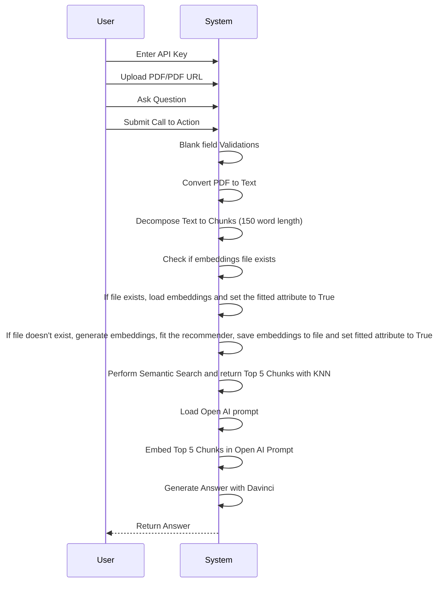
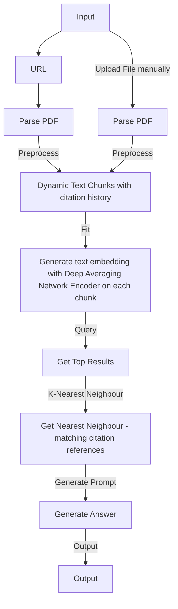

# pdfGPT
## Demo
1. **Demo URL**: https://bhaskartripathi-pdfgpt-turbo.hf.space
2. **Demo Video**:
   
#### Version Updates (27 July, 2023):
1. Improved error handling
2. PDF GPT now supports Turbo models and GPT4 including 16K and 32K token model.
3. Pre-defined questions for auto-filling the input.
4. Implemented Chat History feature.


### Note on model performance
```If you find the response for a specific question in the PDF is not good using Turbo models, then you need to understand that Turbo models such as gpt-3.5-turbo are chat completion models and will not give a good response in some cases where the embedding similarity is low. Despite the claim by OpenAI, the turbo model is not the best model for Q&A. In those specific cases, either use the good old text-DaVinci-003 or use GPT4 and above. These models invariably give you the most relevant output.```

# Upcoming Pipeline:
1. Support for Falcon, Vicuna, Meta Llama
2. OCR Support
3. Multiple PDF file support
4. OCR Support
5. Node.Js based Web Application - With no trial, no API fees. 100% Open source.
    
### Problem Description : 
1. When you pass a large text to Open AI, it suffers from a 4K token limit. It cannot take an entire pdf file as an input
2. Open AI sometimes becomes overtly chatty and returns irrelevant response not directly related to your query. This is because Open AI uses poor embeddings.
3. ChatGPT cannot directly talk to external data. Some solutions use Langchain but it is token hungry if not implemented correctly.
4. There are a number of solutions like https://www.chatpdf.com, https://www.bespacific.com/chat-with-any-pdf, https://www.filechat.io they have poor content quality and are prone to hallucination problem. One good way to avoid hallucinations and improve truthfulness is to use improved embeddings. To solve this problem, I propose to improve embeddings with Universal Sentence Encoder family of algorithms (Read more here: https://tfhub.dev/google/collections/universal-sentence-encoder/1). 

### Solution: What is PDF GPT ?
1. PDF GPT allows you to chat with an uploaded PDF file using GPT functionalities.
2. The application intelligently breaks the document into smaller chunks and employs a powerful Deep Averaging Network Encoder to generate embeddings.
3. A semantic search is first performed on your pdf content and the most relevant embeddings are passed to the Open AI.
4. A custom logic generates precise responses. The returned response can even cite the page number in square brackets([]) where the information is located, adding credibility to the responses and helping to locate pertinent information quickly. The Responses are much better than the naive responses by Open AI.
5. Andrej Karpathy mentioned in this post that KNN algorithm is most appropriate for similar problems: https://twitter.com/karpathy/status/1647025230546886658


{"result":" Zania.ai is the name of the company [Page no. 1].","error":"","stdout":""}
```

## Running on localhost
1. Pull the image by entering the following command in your terminal or command prompt:
2. Download the Universal Sentence Encoder locally to your project's root folder. This is important because otherwise, 915 MB will be downloaded at runtime everytime you run it.
3. Download the encoder using this [link](https://tfhub.dev/google/universal-sentence-encoder/4?tf-hub-format=compressed).
4. Extract the downloaded file and place it in your project's root folder as shown below:
```text
Root folder of your project
└───Universal Sentence Encoder
|   ├───assets
|   └───variables
|   └───saved_model.pb
|
└───app.py
```
5. If you have downloaded it locally, replace the code on line 68 in the API file:
```python
self.use = hub.load('https://tfhub.dev/google/universal-sentence-encoder/4')
```
with:
```python
self.use = hub.load('./Universal Sentence Encoder/')
```
6. Now, To run PDF-GPT, enter the following command:


## UML


### Flowchart

## Star History

[](https://star-history.com/#bhaskatripathi/pdfGPT&Date)
I am looking for more contributors from the open source community who can take up backlog items voluntarily and maintain the application jointly with me.

## Also Try PyViralContent:
Have you ever thought why your social media posts, blog, article, advertising, YouTube video, or other content don't go viral?
I have published a new Python Package: pyviralcontent ! 🚀
It predicts the virality of your content along with readability scores! It uses multiple sophisticated algorithms to calculate your content's readability score and its predict its viral probability using Multi Criteria Decision Analysis. 📈 Make your content strategy data-driven with pyviralcontent. Try it out and take your content's impact to the next level! 💥 

## License
This project is licensed under the MIT License. See the [LICENSE.txt](LICENSE.txt) file for details.

## Citation
If you use PDF-GPT in your research or wish to refer to the examples in this repo, please cite with:

```bibtex
@misc{pdfgpt2023,
  author = {Bhaskar Tripathi},
  title = {PDF-GPT},
  year = {2023},
  publisher = {GitHub},
  journal = {GitHub Repository},
  howpublished = {\url{https://github.com/bhaskatripathi/pdfGPT}}
}
